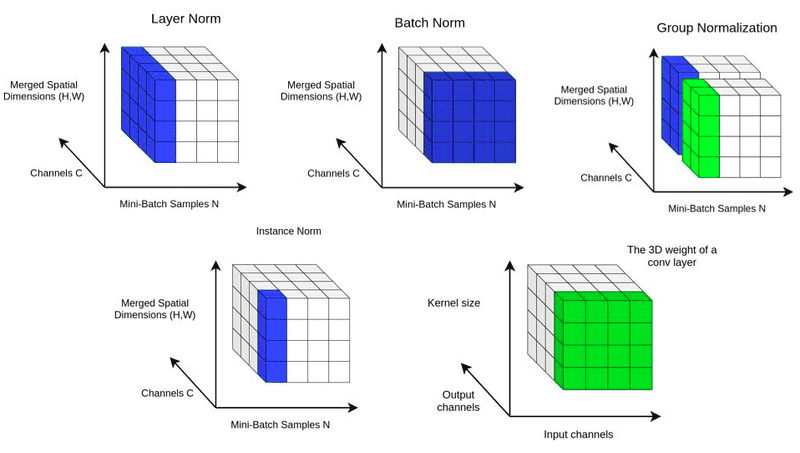
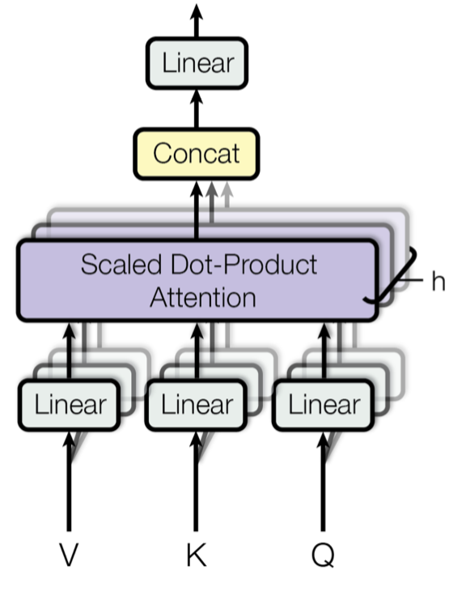
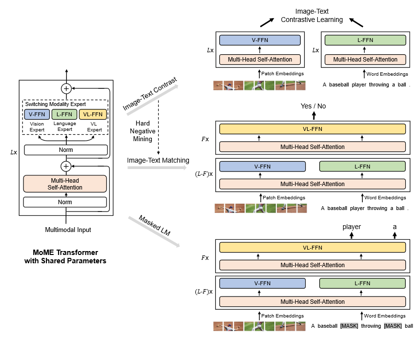
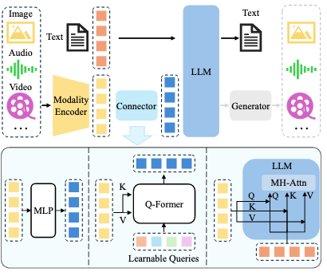

# Transformer


## positional encoding
从tranformer的结构图上可以看见，输入attention之前，在input embedding上加上了positional encoding。
在原始的transformer中的attention是没有方向和位置信息的，因此为了帮助模型感知输入元素间的位置关系，在token交互之前为每个token分配了一个位置编码，这样就可以区分比如“我给你”和“你给我”两种只有位置差异的情况。

- 什么样的位置编码是有效的：

  - 每个位置的编码是唯一且独立的，和输入序列、网络初始化无关

  - 任何两个时间步骤之间的距离在不同长度的句子之间应该是一致的

  - 位置编码应该是连续增长的，而非one-hot这样的离散点， 数值应该是有界的（比如0-1）

  - 对于超长序列是可扩展的
- 整型数作为位置编码有什么问题
  - 对于超长序列位置编码是无上界的，数值会变得特别大，影响模型性能；也不能直接normalize到0-1，这会导致位置编码间的距离受最长序列长度影响
  - 对于没见过的位置编码缺乏泛化能力

- 绝对位置编码和相对位置编码：
  - 绝对位置编码只和绝对位置pos有关，为每个input拼接位置信息
  - 相对位置编码关注两个位置间的相对关系，在模型计算（attention）中引入两个位置间的相对位置信息


  
### Sinusoidal functions
Transformer中位置编码方法是基于sin和cos的三角函数构造的Sinusoidal functions

- 假设每个token的embedding维度为d，pos是token的绝对位置(0,1,2,..)，i是embedding的维度索引
- 这样每个位置的每个维度都可以用sin/cos函数表示，相当于按维度索引分为两组，偶数为sin周期组，奇数为cos组

    $PE(pos,2i) = sin(\frac{pos}{10000^{2i/d_{model}}})$

    $PE(pos,2i+1) = cos(\frac{pos}{10000^{2i/d_{model}}})$

- 相对位置之间存在线性关系，让模型能轻松学会按相对位置进行关注，即对于位置pos，相对位置pos+k可以表示为pos位置的线性倍数

$$
\begin{aligned}
{\left[
PE_{(pos+\Delta, 2 i)} \atop
PE_{(pos+\Delta, 2 i+1)}
\right] }
& =\left[sin \left((pos+\Delta) \cdot \theta_i\right)\atop
cos \left((pos+\Delta) \cdot \theta_i\right)
\right] \\
& =\left[
sin \left({pos} \cdot \theta_i\right) cos \left(\Delta \cdot \theta_i\right)+cos \left({pos} \cdot \theta_i\right) sin \left(\Delta \cdot \theta_i\right) \atop
cos \left({pos} \cdot \theta_i\right) cos \left(\Delta \cdot \theta_i\right)-sin \left({pos} \cdot \theta_i\right) sin \left(\Delta \cdot \theta_i\right)
\right] \\
& =\left[
cos \left(\Delta \theta_i\right) \qquad sin \left(\Delta \theta_i\right)  \atop
-sin \left(\Delta \theta_i\right) \qquad \left(\Delta \theta_i\right)
\right]
\left[
sin \left({pos} \cdot \theta_i\right) \atop
cos \left({pos} \cdot \theta_i\right)
\right] \\
& =\left[
cos \left(\Delta \theta_i\right) \qquad  sin \left(\Delta \theta_i\right) \atop
-sin \left(\Delta \theta_i\right) \qquad  cos \left(\Delta \theta_i\right)
\right]\left[
PE_{(pos, 2 i)} \atop
PE_{(pos, 2 i+1)}
\right]
\end{aligned}
$$


- 随着i的增大，sin/cos函数的周期越长，函数值的变化更缓慢，因此高维位置编码变得难以区分

- 位置编码会不会随着模型的加深而消失？transformer的残差连接可以防止

### 可学习的位置编码
先初始化位置编码，再放到预训练过程中，训练出每个位置的位置向量
- 优点：能够针对特定任务和数据优化位置编码的表示，增强模型表示能力
- 缺点：不支持位置编码的外推；需要更多参数，且存在过拟合风险  

<font color=blue> **位置编码的外推**：1.能否表示更长的序列；2.能否自适应的关注到未经过训练的位置 </font>

### 旋转位置编码RoPE （Llama使用）

- RoPE的编码方法与上述原始Transformer相同之处是都用的是三角函数来表示位置，而不同之处是position embedding与token embedding的融合方式不一样了。原始Transformer的编码方式是先加到token embedding然后经过self-att，RoPE则是将position embedding作用于已经经过了W线性变化之后的向量。

- 在QK的线性变化后再乘上位置编码后计算attention score等价于$q^{T} R_{m-n} k$，位置信息只和相对位置m-n有关，满足相对位置编码的需求

$$
R_n^T R_m = \left[
cos \left(n \theta_i\right) cos \left(m \theta_i\right)+sin \left(n \theta_i\right) sin \left(m \theta_i\right) \qquad -cos \left(n \theta_i\right) sin \left(m \theta_i\right)+sin \left(n \theta_i\right) cos \left(m \theta_i\right) \atop
-sin \left(n \theta_i\right) cos \left(m \theta_i\right)+cos \left(n \theta_i\right) sin \left(m \theta_i\right) \qquad -sin \left(n \theta_i\right) sin \left(m \theta_i\right)+cos \left(n \theta_i\right) cos \left(m \theta_i\right)
\right]
$$
  

$$R_n^T R_m=\left[
cos \left((m-n) \theta_i\right) \qquad -sin \left((m-n) \theta_i\right) \atop
sin \left((m-n) \theta_i\right) \qquad cos \left((m-n) \theta_i\right)
\right] = R_{m-n}$$

$$
q = W_q x_n \\
k = W_k x_m \\
\left(R_n q\right)^{T} R_m k=q^{T} R_{m-n} k
$$

### ALiBi
ALiBi 不向单词embedding中添加位置embedding，而是根据token之间的距离给 attention score 加上一个预设好的偏置矩阵,比如和i相对位置差 1 就加上一个 -1 的偏置，两个 token 距离越远这个负数就越大，代表他们的相互贡献越低,由于注意力机制一般会有多个head，这里针对每一个head会乘上一个预设好的斜率项(Slope)。
$$softmax(q_i·K^T+m[-(i-1),...,-2,-1,0])$$
实验证明这组斜率参数适用于各种文本领域和模型尺寸，不需要在新的数据和架构上调整斜率值, 允许在较短的输入序列上训练模型，同时在推理时能够有效地外推到较长的序列，从而实现了更高的效率和性能。

## normalization
ref: [参考](https://zhuanlan.zhihu.com/p/521535855?utm_psn=1806437682546630657)
- 为什么需要normalization？
  - 对数据的独立同分布要求：独立同分布的数据可以简化常规机器学习模型的训练、提升机器学习模型的预测能力
  - Internal Covariate Shift现象：深度神经网络涉及到很多层的叠加，而每一层的参数更新会导致上层的输入数据分布发生变化，通过层层叠加，高层的输入分布变化会非常剧烈，这就使得高层需要不断去重新适应底层的参数更新。为了训好模型，我们需要非常谨慎地去设定学习率、初始化权重、以及尽可能细致的参数更新策略。Internal covariate shift就是指神经网络层内后的分布与各层对应的输入信号分布不同，这导致每个神经元的输入数据不再是“独立同分布”
白化（whitening）是一个重要的数据预处理步骤。白化一般包含两个目的：
1. 去除特征之间的相关性 —> 独立；
2. 使得所有特征具有相同的均值和方差 —> 同分布。
但是在每层输入前都进行白化操作是昂贵且不一定可微的
### batch normalization
以 BN 为代表的 Normalization 对每层数据进行了简化的白化操作，在将数据送给神经元之前，先对其做平移和伸缩变换， 将数据的分布规范化成在固定区间范围的标准分布。
$$h=f(\gamma· \frac{x-\mu}{\sigma}+\beta)$$
包括两部分：（1）将数据限制到均值为0，方差为1的确定范围内 （2）为了保证模型的表达能力不因为规范化而下降，为每个神经元使用可学习的参数 $\gamma,\beta$再次对数据进行放缩和平移（仿射变换），使其数据范围保持在均值为$\beta$,方差为$\gamma^2$的范围内

**batch内计算均值和方差的方式**：

训练时对batch中的所有样本的每一维特征都计算一个均值和方差来更新记录的均值和方差，为每一个特征维度都维护一个分布。对于图像样本(N,C,H,W)来说特征维度有C个，mean和std的形状就是(C,)，其仿射变换的参数也是（C,）。

**更新全局的均值和方差**: $\alpha$是平滑参数，一般为0.1

$$
\begin{aligned}
\mu_{{running }} & =(1-\alpha) \mu_{{running }}+\alpha \mu_{{batch }} \\
\sigma_{{running }}^2 & =(1-\alpha) \sigma_{{running }}^2+\alpha \sigma_{{batch }}^2
\end{aligned}
$$

BN参数是从mini-batch计算的统计量，这要求每个mini-batch的统计量是整体统计量的近似估计。如果mini-batch的原始分布差别很大，会导致数据标准化波动过大进而影响训练。

**为什么一般不在语言模型中使用batch norm？**
- 如果要直接应用到序列样本(N,L,C)，mean和std也是（C，），但由于变长的数据不确定，而batch norm是根据batch中的样本来更新mean和std的，可能导致波动大，训练不稳定。
- 不适用于语言序列数据：由于是对batch中样本的每个特征维度统计来估计全局，无法应对语言序列中token变化、变长数据带来的batch内剧烈的分布变化
  
<!-- 
 -->


### layer normlization
LN在每个样本的所有特征维度操作，所有特征在一个样本中共同维护一个数据分布，对于一个batch数据（N,L,D）需要 N\*L 个分布，需要计算 N\*L 个均值方差。

层归一化会计算每一层中所有激活值的均值 𝝁 和方差 𝝈，对应到标准公式中，四大参数均为标量，来重新调整激活值的中心和缩放比例，因此归一化不会在训练案例之间引入任何新的依赖关系。D表示层中hidden units的数
因为LN 针对单个训练样本进行，不依赖于其他数据，因此可以避免 BN 中受 mini-batch 数据分布影响的问题。
 
$LayerNorm(x)=\gamma*\frac{x-\mu}{\sigma}+\beta\\
\mu=\frac{1}{D}\sum^D_{i=1}x_i, \sigma=\sqrt{\frac{1}{D}\sum^D_{i=1}(x_i-\mu)^2}$

对于输入为（N,L,D）的序列特征，layernorm计算的mean和std的维度为(N,L,1),相当于对每个(1,1,D)计算一次 $\mu , \sigma , \gamma ,\beta$ ，其中每次的仿射变换的参数为(1,1,D)
对于输入为(N,C,H,W)的特征，LN是对单个样本的所有hidden units计算。通常 CV 中，一个layer 的 units 是 (C,H,W)，因此对所有特征维度(C*H*W)计算mean和std，维度是(N,1,1)。
在实际应用中在CNN中使用 LN 对 (C,H,W) 操作，效果通常不太好，所以通常不这么做，一般做法是使用instance norm也就是mean和std的维度是(N,C,1)。

**layer norm和batch norm的区别（个人理解）**

batch norm认为每个特征channel表达的是一种pattern，因此有C种特征就需要C组分布的mean和std，从而可以比较样本的同一特征维度来比较差异；

而对于一段文本来说，文本的pattern来自于多方面（1）词义级别的局部pattern （2）上下文依赖的pattern（句法与语义结构）（3）全局语义（比如cls位置的信息） （4）序列动态信息（比如逻辑推理链，时间顺序等）

一部分pattern可以用token向量表示，因此每个token的每一维特征可以视为这个语义的每一种pattern（比如词性、类别、情感），应该服从同一分布；
词与词之间的关系或者序列的动态信息的pattern受token组合、位置、方向影响很大，不能像batch norm一样不同样本使用同一组统计量来标准化

<!-- **layer norm和instance norm的区别**
instance norm(IN):计算归一化统计量时考虑单个样本，单个通道的所有元素,对于输入为(N,C,H,W)，输出mean和std的维度为(N,C,1)
考虑一个[B, S, E]的tensor，LN和IN都是对N*L个[1, 1, E]的变量求均值和方差，得到一个[B, S, 1]形状的均值和方差，两者不同是在仿射变化一步，LN中的仿射变化参数beta和gamma的形状是[1, 1, E]，而IN中是[1, S, 1]， -->

### RMSNorm
为了提高层归一化的训练速度，RMSNorm 仅利用激活值总和的均方根 RMS(𝒙) 对激活值进行重新缩放

$$
RMSNorm=\frac{x}{RMS(x)}·\gamma
$$

$$
RMS(x)=\sqrt{\frac{1}{D}\sum^D_{i=1}x_i^2}
$$

### DeepNorm
DeepNorm 在 LayerNorm 的基础上，在残差连接中对之前的激活值 𝒙 按照一定比例 𝛼 进行放缩。通过这一简单的操作，Transformer 的 层数可以被成功地扩展至 1,000 层，进而有效提升了模型性能与训练稳定性.Sublayer 表示 Transformer 层中的前馈神经网络或自注意力模块


以上公式对应N -layer encoder, M -layer decoder，通过在残差连接上引入常数,使得残差分支的梯度幅度被显式限制,这种放大操作限制了不同层之间的更新强度，避免了深层网络中梯度累积导致的爆炸性增长。

随着transfomer层数的加深，梯度是增大的，因此容易在深层发生梯度爆炸或者消失。考虑两类不同位置的LN，Post-LN：不稳定，效果好；Pre-LN：稳定，效果一般，作者希望通过改进LN使得其同时稳定且效果好

### norm的位置
归一化模块的位置通常有三种选择，分别是层后归一化(Post-Layer Normalization, Post-Norm)、层前归一化(Pre-Layer Normalization, Pre-Norm)和夹心归一化(Sandwich-Layer Normalization, Sandwich- Norm)。

- post norm：在残差计算之后使用norm，加快训练收敛速度，降低神经网络对于超参数(如学习率、初始 化参数等)的敏感性；但在输出层附近存在梯度较大，容易训练不稳定
  - 在没有经过较好初始化与warmup的Post-LN，在**模型训练初期**，Post-LN显示了爆炸更新，而经过较好初始化以及warmup的Post-LN，模型更新没有爆炸式更新，训练很稳定

- pre norm：归一化模块应用在每个子层（残差中的sublayer）之前，对子层的输入的进行了归一化，防止梯度爆炸或消失，虽然训练稳定但实验证明性能低于post-norm
  - **​深度诅咒：** 使用预层归一化（Pre-LN）的模型中，随着层数的增加，输出方差呈指数级增长，由于深层网络的输出方差过大，激活函数的输入值分布变得非常广泛，导致激活函数的导数接近于常数。对于常见的激活函数（如ReLU），其导数在输入值较大时接近于1，而在输入值较小时接近于0。因此，深层网络的导数在整体上接近于单位矩阵，意味着每一层的变换对输入的影响很小，几乎不贡献任何有效的信息

- sandwich norm：在pre norm的基础之上，在sublayer后也加norm，理论上应该有pre/post norm两种位置的优点，但是依然会存在训练崩溃的问题


## multi-head attention

multi-head attention由多个自注意力模块组成，每个自注意力模块将输入序列映射为query、key、value

$Q=XW^Q, K=XW^K, V=XW^V\\
head=Attention(Q,K,V)=softmax(\frac{QK^T}{\sqrt(D)})V$

多头注意力使用一组query/key/value，不同头的输出被拼接在一起，并通过一个权重矩阵$W^O$进行映射，产生最终的输出

$MHA=Concat(head1,head2,...,head_h)W^O$

$W^Q,W^K,W^K,W^O$的尺度都为(D,D)

单个attention的实现方式
```
def attention(query, key, value, mask=None, dropout=None):
    "Compute 'Scaled Dot Product Attention'"
    d_k = query.size(-1)
    scores = torch.matmul(query, key.transpose(-2, -1)) \
             / math.sqrt(d_k)
    if mask is not None:
        scores = scores.masked_fill(mask == 0, -1e9)
    p_attn = F.softmax(scores, dim = -1)
    if dropout is not None:
        p_attn = dropout(p_attn)
    return torch.matmul(p_attn, value), p_attn
```

多头注意力机制
```
class MultiHeadedAttention(nn.Module):
    def __init__(self, h, d_model, dropout=0.1):
        '''
        h: head number
        '''
        super(MultiHeadedAttention, self).__init__()
        assert d_model % h == 0
        # We assume d_v always equals d
        self.d = d_model // h
        self.h = h
        self.linears = clones(nn.Linear(d_model, d_model), 4)
        self.attn = None
        self.dropout = nn.Dropout(p=dropout)
        
    def forward(self, query, key, value, mask=None):
        if mask is not None:
            # Same mask applied to all h heads.
            mask = mask.unsqueeze(1)
        nbatches = query.size(0)
        
        # 1) Do all the linear projections in batch from d_model => h x d 
        query, key, value = \
            [l(x).view(nbatches, -1, self.h, self.d).transpose(1, 2)
             for l, x in zip(self.linears, (query, key, value))]
        
        # 2) Apply attention on all the projected vectors in batch. 
        x, self.attn = attention(query, key, value, mask=mask, 
                                 dropout=self.dropout)
        
        # 3) "Concat" using a view and apply a final linear. 
        x = x.transpose(1, 2).contiguous() \
             .view(nbatches, -1, self.h * self.d)
        return self.linears[-1](x)
```


# 多模态模型的视觉编码器

## CNN
CNN应用于视觉表征有着很强的归纳偏置或者说先验（归纳偏置是模型为了从有限的数据中学习并泛化到新数据，所内置的假设或偏好。它决定了模型如何对未见过的数据进行预测）。

CNN的架构设计天然嵌入了对视觉数据的先验知识，主要体现在以下特性中：

**(1) 局部性（Locality）**

卷积核的局部感受野：CNN假设图像中的信息具有局部相关性（例如，边缘、纹理等特征通常由局部像素组成），避免全连接网络的冗余参数，更高效地捕捉局部模式。

**(2) 平移不变性（Translation Invariance）**

权值共享：同一卷积核在图像不同位置滑动，检测相同特征（例如，无论猫耳朵出现在图像左侧还是右侧，都能被同一卷积核识别）。模型无需重新学习不同位置的特征，减少了参数数量。

**(3) 层次化结构（Hierarchy）**

特征抽象层级：浅层卷积捕捉低级特征（边缘、颜色），深层卷积组合成高级语义（物体部件、整体形状）。这模仿了人类视觉系统的分层处理方式。

**(4) 空间不变性（Spatial Invariance）**

池化操作：通过下采样（如最大池化）容忍轻微的平移、旋转或缩放，增强模型对输入微小变化的鲁棒性。

## ViT
现在的VLMs通常使用CLIP ViT来作为视觉编码器，虽然相比于CNN，Transformer结构缺少视觉的先验设计，其Self-Attention层是全局的，对于视觉输入的局部关系建模、图像的2D位置关系的建模，以及图像元素的平移不变性的把握上，都需要从头学习。ViT的出现，以及CLIP使用大量预训练所取得的成果都使得ViT这样的Transformer结构成为主流。


### patch embedding

例如输入图片大小为224x224，将图片分为固定大小的patch，patch大小为16x16，则每张图像会生成224x224/16x16=196个patch，即输入序列长度为196，每个patch维度16x16x3=768。通过一个线性投射层映射patch为196x768的embedding，即一共有196个视觉token，每个token的维度是768。通过加上一个可学习的token作为class的embedding，因此最终的维度是197x768。

### position embedding

Transformer的自注意力机制本身是置换等变的（permutation-equivariant），即打乱输入序列顺序会导致输出顺序相应改变，但模型无法感知原始位置关系，因此需要位置编码来保留图像中物体的位置、方向、相邻关系等高度依赖空间位置的语义信息。
vit中使用的是标准可学习的1D位置编码，将位置编码加到patch embedding上组成encoder的输入。
每个patch被赋予一个位置索引$i \in \{0,1,...,N-1\}$，表示其在图像中的顺序（通常按行优先或列优先排列）。
定义一个可学习的矩阵 $E_{pos} \in R^{N \times D}$,其中 D是嵌入向量的维度。

将位置编码直接加到对应的patch嵌入向量上:

$$ z_0=[x_{class};x_{patch}^1E;x_{patch}^2E;...;x_{patch}^nE]+E_{pos} $$

其中E代表patch embedding的线性变换.


其他编码方式：vit实验表明不同的位置编码效果差别不大
- 2D编码：显式编码二维位置（如分别编码行和列坐标）


### 预训练策略
**原始ViT**

在 ImageNet上从头开始预训练模型。对于大于预训练分辨率的图像，将一维位置编码视为二维网格（如14×14），通过插值扩展为更大的网格（如24×24）

**MAE**

MAE以VIT为基础模型，先对完整图片进行Patch掩码，接着使用一个Transformer Encoder对未Mask的Patch进行编码，然后通过相对小的Transformer Decoder模型还原被Masked Patch，从而实现模型的自监督预训练.
MAE取得成功的另一个核心原因是通过75%的高掩码率（相比于一般在NLP中使用的15%）来对图像添加噪音，这样图像便很难通过周围的像素来对被掩码的像素进行重建，从而使编码器去学习图像中的语义信息。预训练之后，解码器被丢弃，编码器可以应用于未掩码的图像来进行识别任务。

**BEiT**


在预训练之前，BEIT先通过一个离散自回归编码器（ discrete Variational AutoEncoder，dVAE）学习了一个“图像分词”器，最终可以将图像编码成离散的视觉Token集合。而在预训练阶段，输入的图片存在两个视角，一是图像Patch，另一个是视觉Token。BEIT随机对Patch进行掩码，并将掩码部分替换为特殊的Mask Embedding（[M]，图中的灰色部分），随后将掩码后的Patch序列输入到VIT结构的模型中。预训练的目标则是基于被掩码的图像输入向量序列，预测源图像对应的视觉Token。

BEIT需要单独的dVAE网络辅助，相对MAE更为复杂。在效果上，MAE验证了使用normalized pixels进行目标像素重建，也可以实现类似效果，因此视觉tokenization过程并非必须。

**CLIP ViT**

通过对比学习的方法进行视觉和自然语言表征的对齐。CLIP首先分别对文本和图像进行特征抽取，文本的Encoder为预训练BERT，视觉侧的Encoder为VIT系列模型。得到图文表征向量后，在对特征进行标准化（Normalize）后计算Batch内图文Pair对之间的余弦距离，通过InfoNCELoss目标函数拉近正样本对之间的距离，同时使负样本对的距离拉远。

### 高分辨率支持

MiniCPM-V 自适应地将原始图像划分为不同部分（如 1x6、2x3、4x2、8x1），并采用二维位置嵌入插值来支持图像分割。

LLaVa-OneVision 先将原始图像下采样为视觉编码器输入大小，然后将图像划分为不同裁剪块，通过双线性插值减少输入尺寸。

InternVL1.5 方法与 LLaVa-OneVision 类似，但使用 PixelShuffle 技术减少标记大小。

MM1.5 采用与 LLaVa-OneVision 类似的方法，并对图像填充进行特殊处理，生成 378×378 的图像块，同时尽量减少分辨率损失。

Qwen2-VL 通过在 ViT 后添加一个额外的 MLP 来支持更大的图像输入，同时使用二维旋转位置编码（2D RoPE）作为位置嵌入。

<!-- ## diffusion based

CLIP ViT因为使用有监督的方式进行训练，为了对齐image和text，就会忽略一些不相关的视觉信息，当处理OOD的图片，就可能导致视觉编码器提取的图像特征出现偏差，错误再传递到LLM，导致不期待的输出。而Diffusion建模是直接建模数据概率分布，与下游任务无关，对于分布外图片的处理是更合适的图像编码器，因此本文希望能够引入diffusion来帮助mllm理解图片，而不是和之前介绍的文章直接把diffusion产生特征抽出来输入llm中，本文希望借助diffusion去重新对齐vision encoder的语义信息，补充对图像的细节理解。另外，由于diffusion的引入，可以进一步为mllm配备生成能力，基于mllm输出的image token去生成图像。 -->

# 语言编码器
目前的大多数 LLM 都属于因果解码器类别，因果解码器架构包含一个单向注意力掩模，允许每个输入token仅关注过去的token及其自身。输入和输出令牌都在同一解码器内处理。其中，FlanT5 系列是相对较早的 LLM，用于 BLIP-2  和 InstructBLIP 等工作。LLaMA 系列 和 Vicuna 系列是具有代表性的开源 LLM， 主要是在英语语料库上进行预训练的，因此它们在多语言支持（例如中文）方面受到限制。相比之下，Qwen是一个双语 LLM，能很好地支持中文和英文。

应该注意的是，扩大 LLM 的参数大小也会带来额外的增益，类似于提高 input resolution 的情况。也有一些作品使用较小的 LLM 来在移动设备上部署。例如，MobileVLM 系列 使用缩小的 LLaMA （称为 MobileLLaMA 1.4B/2.7B），从而在移动处理器上实现高效推理。

对 LLM 的专家混合 （MoE） 架构的探索引起了越来越多的关注。与密集模型相比，稀疏架构可以通过选择性激活参数来扩展总参数大小，而不会增加计算成本。从经验上讲，MM1和 MoE-LLaVA 发现，在几乎所有基准上，MoE 实现的性能都优于密集实现。
<!-- ## tokenizer

## word embedding

## main-stream architecture

## casual attention -->


# 模态对齐和融合

## 自监督预训练
在多模态模型上使用各种预训练任务来达到模态间对齐和融合的目标。
**image-text contrastive loss：**
   
对比学习的loss: $z_i,z_j$为正样本, $z _k$为负样本，sim是相似函数, $\tau$是温度参数

$$L=-log\frac{exp(sim(z_i,z_j)/\tau）}{\sum^{N}_{K=1}exp(sim(z_i,z_k)/\tau）}$$

CLIP中的对比学习损失伪代码：


**masked language modeling：**

将15%的token替换为特殊token[mask],然后在多模态融合后对mask token进行恢复，期望模型能根据其他模态的线索恢复出被mask的信息以此达到模态融合的目的。

$${L}_{{mlm}}=CrossEntropy\left({y}^{{msk}}, {p}^{{msk}}(I, \hat{T})\right)$$

$y^{mask}$是one-hot词汇表长向量，其中 ground-truth token 的概率为 1
本质上也是在用masking的方式“扰动数据”，强迫模型根据扰动后的数据得到的特征抓住不变的核心信息。

**image-text matching**

ITM通过预测一对图像和文本是正数（匹配）还是负数（不匹配），来对齐图像和文本的表示空间。一般使用多模态编码器的 [CLS] 标记输出嵌入作为图像-文本对的联合表示，并附加一个全连接 （FC） 层，后跟 softmax 来预测两类概率。

 $${L}_{{itm}}=CrossEntropy\left({y}^{{itm}}, {p}^{{itm}}(I, T)\right)$$

<!-- CLIP：视觉经过ViT，文本经过bert，然后将两个模态的向量特征用点乘度量相似度。通过在大量数据上使用对比学习（IT）进行预训练来对齐视觉和文本模态, 融合方式使用简单的点乘。对于细粒度/复杂的VL任务，由于简单的融合方式会难以完成。

VILT：VILT将文本和视觉Patch的Embedding直接拼接作为Transformer编码器的输入，使用ITM\MLM\word-patch alignment对视觉语言进行对齐。

ALBEF：核心思想是在融合前进行对齐，在vision/text encoder后使用ITC预训练进行对齐，然后使用带cross-attention的encoder以及ITM/MLM任务预训练进行融合 -->

## multi-model encoder/decoder
使用一个encoder/deocoder的结构，input为text encoder 的输出，cross-attention的key/value由image encoder输出决定比如CoCA/ALBEF/BLIP, 再结合MLM/ITM这样的自监督任务，或者加上image caption这样的生成任务进行预训练。Encoder结构能够满足理解任务，但对于生成任务需要使用decoder结构。


## modality expert
在多模态模型中构建多个适用不同情况/模态的expert，以混合专家的方式来灵活应对不同任务。
VLMO在FFN模块中分成了三种专家（vision/language/vision-language），首先在大规模纯图像数据上预训练视觉专家 （V-FFN） 和Self-Att。然后，冻结V-FFN和Self-Att的参数，在大量纯文本数据上进行MLM来训练语言专家 （L-FFN）。最后，在全部参数上使用VL数据进行训练



## connector for LLM

随着语言模型向大模型切换，多模态模型结构也随之改变为在LLM和vision encoder间加入一个适配器，这个适配器将视觉特征向大语言模型的编码空间对齐，为了使大语言模型具备完成VL任务的能力需要使用多模态的指令数据来进行微调。这个适配器有多种形式比如MLP/cross-attention/Q-Former。


  
**LLAVA**

使用线性映射将图像特征映射到语言空间，映射后的向量直接和多模态指令拼接后生成回复。训练分为两阶段，（1）使用指令数据对W进行训练，（2）针对不同的下游任务（比如QA或者对话机器人）使用下游数据微调W和LLM。


**Qwen-vl**

使用cross-attention作为模态适配器,分成三个阶段进行训练


**intern-vl**

使用一个预训练的llama模型作为中间件，旨在协调视觉和语言特征。

QLLaMA 是基于预先训练的多语言 LLaMA开发的，并新增了 96 个随机初始化的可学习查询和交叉注意力层（10 亿个参数）。这种方式使 QLLaMA 能够顺利地将视觉元素集成到语言模型中，从而增强组合特征的连贯性和有效性。


**BLIP2**

利用一组可学习的查询标记以基于查询的方式提视觉模态的信息,将这组可学习的query作为额外的token输入LLM。

首先通过ITC/ITM/ITG训练Q-Former，学习视觉-文本的表征。


在第二阶段，BLIP-2尝试了两种不同结构的大语言模型，第一种是decoder-based，这种模型就将query embedding输入，去做生成任务即可，第二种是encoder-decoder-based，这种模型将想要生成的ground truth文本分成两部分，一部分放到query embedding后面作为输入，另外一部分成为新的ground truth。


然后视觉到语言的生成学习。Q-Former的输出作为软视觉提示（Soft Visual Prompt）输入到LLM中，生成与视觉相关的文本